<!DOCTYPE html>
<html lang="en">

<head>

    <meta charset="UTF-8">
    <meta name="viewport" content="width=device-width, initial-scale=1.0">
    <meta http-equiv="X-UA-Compatible" content="ie=edge">
    <link rel="stylesheet" href="Css/reset.css">
    <link rel="stylesheet" href="Css/style.css">
    <title>Boel</title>
</head>

<body>
    

    <main>
        <header>
            

            

                

                    <ul>
                        <li>Почему Китай?</li>
                        <li>Заказ напрямую</li>
                        <li>Гарантии</li>
                        <li>Портфолио</li>
                        <li>Контакты</li>
                    </ul>
                

                

                    
+7 (383) 287 11 57

                

            

        </header>

        <section id="product-getting">
            

                <h1>Получите  высокоточную  пресс-форму  через 36 дней
                </h1>
                <h4>за счёт экспресс-производства в Китае</h4>
                

                    

                        

                        
Вы решили запустить или
                            перевооружить производство
                            полимерного литья под
                            давлением, и думаете как
                            сделать это с минимальным
                            простоем и по выгодной цене?

                    

                    

                        

                        
Мы изготовим для вас
                            пресс-форму любой сложности.
                            А так же полностью сопроводим
                            процесс от её проектирования
                            до пуско-наладки на вашем ТПА

                    

                

                

                    
                    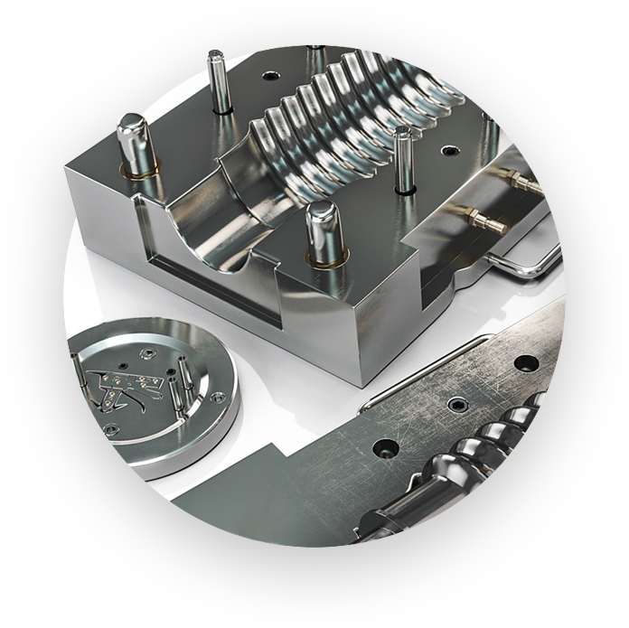
                

                
                

                    

                        
Получить предложение

                        <button></button>
                    

                

            

        </section>

        <h2>BOEL — стабильно высокое качество
            по конкурентной цене</h2>
        

        <section id="section-boel">
            

                
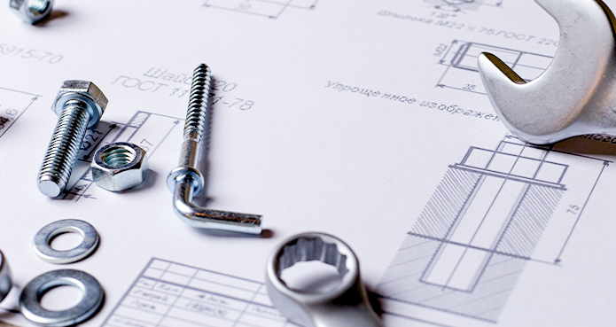

                

                    
                    
С 2004 г. выпускаем пресс-формы и продукцию из пластмасс для собственных нужд. Разработали
                        линейку устройств для быстрого и беспенного розлива пивной продукции. В каждом таком изделии
                        используется 15 и более сложных деталей. И в РФ не нашлось изготовителя, который справился бы с
                        подобной задачей.

                    
Поэтому мы наладили собственное производство по выпуску пресс-форм и литью. Полностью освоив
                        технологии и расширив производственные мощности, можем в короткие сроки изготавливать ПФ и
                        литьевые пластиковые детали высокого качества на заказ

                

                

            

            

                <h4>Что вы получаете при сотрудничестве с нами:</h4>
                

                    

                        

                        
36 дней — срок годности заказа с момента одобрения проектной документации

                    

                    

                        

                        
Возможность контролировать процесс дистанционно, без визитов в наш офис или на производство.
                        

                    

                    

                        

                        
Возможность контролировать процесс дистанционно, без визитов в наш офис или на производство.
                        

                    

                    

                        

                        
Оффициальные гарантии качества как пресс-форм, так и отливаемых на них деталей

                    

                

            

        </section>

        <section id="section-China">
            

                <h2>Зачем нужны мы?</h2>
                <h4>Ведь можно заказать форму напрямую в Китае?</h4>
                <h4>Если немного посчитать — это не выгодно</h4>
            

            

            

                

                    

                    <h3>250</h3>
                    <h5>часов</h5>
                    
Объём затрат времени на
                        поиск поставщика и личное
                        погружение в тему, с учётом,
                        командировок, переговоров,
                        и изучения мат. части.

                

                

                    

                    <h3>2 000</h3>
                    <h5>рублей в час</h5>
                    
Минимальная стоимость
                        времени руководителя
                        с личным доходом в 350 000
                        рублей в месяц (цифра
                        абстрактная, подставьте
                        свою).

                

                

                    

                    <h3>2</h3>
                    <h5>перелёта</h5>
                    
Минимально возможное
                        количество для того чтобы
                        установить контакт с заводом-
                        изготовителем и согласовать
                        предварительную стоимость
                        изделия.

                

                

                    

                    <h3>2</h3>
                    <h5>месяца</h5>
                    
собственного ежедневного
                        труда (это если работать
                        в быстром темпе), делегировать
                        это сотруднику проблематично
                        т.к. степень ответственности
                        и рисков высока.

                

            

            

                

                    

                

                

                    

                        

                            <h3>500 000 ₽</h3>
                            <h5>средняя стоимость</h5>
                        

                        

                            
По нашим прикидкам, это полная стоимость
                                средней пресс-формы вместе с доставкой в РФ.
                                При том, что форма ещё не готова, а вы только
                                нашли поставщика и договорились с ним
                                о производстве и предварительной цене
                                изделия.

                        

                    

                

            

        </section>
        <section id="Why-china">
            

                <h2>Почему именно в Китае?</h2>
                <h4>Мы долго искали варианты размещения своей  
                    производственной площадки и остановились  
                    на городе Шэньчжэнь </h4>
            

            

            

            <h4>Благодаря чему мы получаем лучшую себестоимость и сроки</h4>
            

                

                    

                        

                    

                    

                    <h5>Крупный   логистический   хаб</h5>
                    

                        

                        
Площадка находится в городе
                            Шэньчжэнь. является одним из
                            наиболее динамично развивающихся
                            городов Китая, четвёртым из числа
                            наиболее конкурентоспособных
                            городов страны, крупнейшим среди
                            китайских городов по объёму
                            экспортной логистики.

                    

                

                

                    

                        

                    

                    
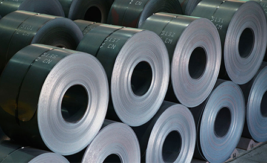

                    <h5>Технологии   и сырье</h5>
                    

                        

                        
Большинство производственных
                            компаний которые производят
                            пресс-формы в России, работают на
                            Китайском обрудовании и сырье. Мы
                            приняли решение покупать станки
                            и сталь на месте, чтобы сэкономить
                            на их доставке в РФ, и снизить
                            себестоимость.

                    

                

                

                    

                        

                    

                    
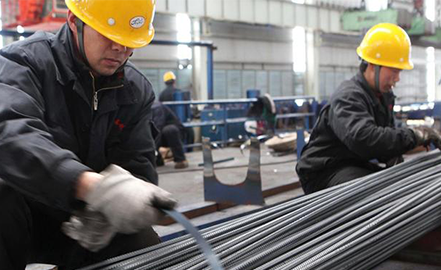

                    <h5>Отсутствие   кадрового   голода</h5>
                    

                        

                        
Всё таки главная причина, это
                            большой выбор обученного персонала,
                            уже с опытом практической работы
                            на сложных и высокточных станках.
                            В РФ есть большие проблемы
                            с квалифицированным
                            производственным персоналом.
                            Например нанять опытного токаря
                            или фрезеровщика в Новосибирске,
                            целая проблема.

                    

                

            

        </section>

        <section id="offer-section">
            

                <h2>Что мы предлагаем?</h2>
                <h4>Сократить путь, обойдя все грабли, на которые  
                    мы уже наступили вместо вас.  
                    Сэкономить своё время и ресурсы</h4>
            

            

                

                    

                        

                            

                        

                        
                        <h4>Какой результат вы имеете заказав
                            пресс-форму в Китае самостоятельно?</h4>
                    

                    

                        <ul>
                            <li>
                                

                                
 <b>4 месяца</b> чистого времени (при идеальном раскладе)

                            </li>
                            <li>
                                

                                
<b>1 млн. рублей</b> прямых и косвенных затрат

                            </li>
                            <li>
                                

                                
1-2 дополнительных <b>командировки</b> в КНР для принятия  
                                    оперативных решений

                            </li>
                            <li>
                                

                                
<b>Куча проблем</b> с ВЭД и доставкой формы к вам на склад

                            </li>
                            <li>
                                

                                
Пресс-форма <b> неочевидного качества </b> у вас на складе

                            </li>
                            <li>
                                

                                
Производство, которое <b>ещё не запущено</b> 

                            </li>
                        </ul>
                    

                

                

                    

                        

                            

                        

                        
                        <h4 style="margin-top: 40px;">Какой результат вы имеете заказав
                            пресс-форму в Китае самостоятельно?</h4>
                    

                    

                        <ul>
                            <li>
                                

                                    

                                    

                                

                                
  36 дней  с момента согласования договора и проектной  
                                    документации

                            </li>
                            <li>
                                

                                    

                                    

                                

                                
Вы платите только за изготовление и доставку   
                                    пресс-формы. Остальное мы сделаем за вас

                            </li>
                            <li>
                                

                                    

                                    

                                

                                
Весь процесс можно контролировать не выезжая из офиса

                            </li>
                            <li>
                                

                                    

                                    

                                

                                
Прописываем в техническом задании к договору рассчётное  
                                    количество смыканий, на которое  даётся гарантия. При  
                                    соблюдении правил эксплуатации

                            </li>

                        </ul>
                    

                

            

        </section>

        <section id="warranty-section">
            <h2>Почему мы можем  
                давать такие гарантии?</h2>
            <h4>Для этого у нас есть</h4>
            

                

                    

                        

                        
                        <h6>01. Практический опыт</h6>
                        
Мы изготовили в Китае и запустили в эксплуатацию
                            более 50 прессформ разной степени сложности для
                            собственного производства. А так же 100 прессформ
                            для наших постоянных клиентов. Примеры пресс-форм
                            можно посмотреть в каталоге

                    

                    

                        

                        
                        <h6>03. Отработанные схемы логистики и ВЭД</h6>
                        
Благодаря отшлифованному алгоритму действий,
                            и пониманию специфики бюрократии КНР мы можем
                            сократить срок поставки формы на ваш склад
                            до минимума

                    

                    

                        

                        
                        <h6>05. Любая сложность </h6>
                        
Мы не менеджеры, мы производственники
                            и технологи. У нас есть опыт в производстве изделий
                            с высокоточными резьбами из пластика, изделия
                            с закладными деталями, а так – же высокий стандарт
                            эстетики внешнего вида пластиковой поверхности

                    

                

                

                    

                    

                    

                    
                

                

                    

                        

                        
                        <h6>02. Гибкая цена и гарантии</h6>
                        
Стоимость пресс-формы зависит от качества
                            и твёрдости материала исполнения пресс-формы.
                            Мы подберём нужный материал, исходя из объёмов
                            предполагаемого тиража, и гарантируем нужное
                            количество смыканий и ресурс формы

                    

                    

                        

                        
                        <h6>04. Технологические компетенции</h6>
                        
За время работы в нише пресс-форм и литья пластика
                            мы спроектировали много уникальных и сложных
                            деталей и запустили их в тиражное производство.
                            Ознакомиться с ними можно в нашем портфолио

                    

                    

                        

                        
                        <h6>06. Наша цель — клиенты навсегда</h6>
                        
Когда мы выпускаем пресс-форму, мы в первую
                            очередь думаем, а что с ней будет после гарантийного
                            срока, как обслуживать и ремонтировать, какой у неё
                            дальнейший ресурс, поэтому сотрудничество с нашей
                            компанией это партнёрство на очень долгий срок

                    

                

            

                    

            

                

                    

                

                

                    <h5>Обсудим ваше ТЗ  
                        или спецификацию?</h5>
                    
Мы работаем по всей России. Оставьте ваш номер  
                        телефона и город, и менеджер перезвонит вам  
                        в течение ВАШЕГО рабочего дня

                

                

                    <input type="text" placeholder="Ваш номер телефона">
                    <input type="text" placeholder="Ваш город">
                    

                        

                            
Заказать звонок

                            <button></button>
                        

                    

                

            

                

        </section>

        <section id="video-section">
            

                <h2>Расскажем за  45 секунд
                </h2>
                <h6>Почему наши возможности и компетенции превосходят 80% компаний  
                    представленных на рынке РФ и СНГ. Покажем уникальные изделия, которые  
                    мы запустили в серийное производство. Примеры этих изделий можно  
                    так же посмотреть, приехав  к нам в офис</h6>
            

            

            

            

                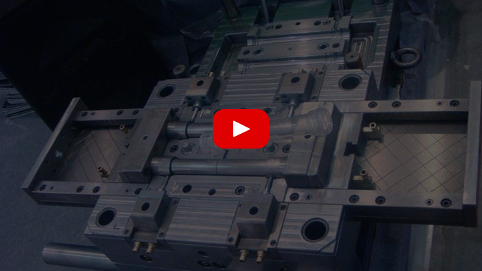
            

            

        </section>

        <section id="Catalog">
            

                <h2>Каталог наших изделий</h2>
            

            

            

                

                    

                        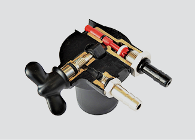  
                        

                            

                                

                            

                            

                                <h6>Название изделия</h6>
                                
Краткое описание изделия,  
                                    характеристика,  
                                    что-нибудь еще

                            

                        

                    

                    

                        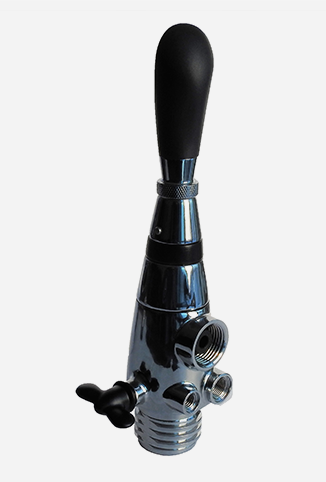
                        

                            

                                

                            

                            

                                <h6>Название изделия</h6>
                                
Краткое описание изделия,  
                                    характеристика,  
                                    что-нибудь еще

                            

                        

                    

                

                

                    

                        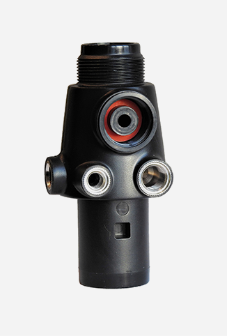  
                        

                            

                                

                            

                            

                                <h6>Название изделия</h6>
                                
Краткое описание изделия,  
                                    характеристика,  
                                    что-нибудь еще

                            

                        

                    

                    

                        

                            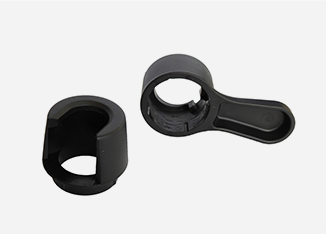
                            

                                

                                    

                                

                                

                                    <h6>Название изделия</h6>
                                    
Краткое описание изделия,  
                                        характеристика,  
                                        что-нибудь еще

                                

                            

                        

                    

                

                

                    

                        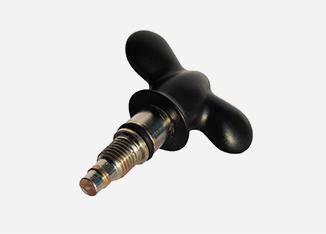  
                        

                            

                                

                            

                            

                                <h6>Название изделия</h6>
                                
Краткое описание изделия,  
                                    характеристика,  
                                    что-нибудь еще

                            

                        

                    

                    

                        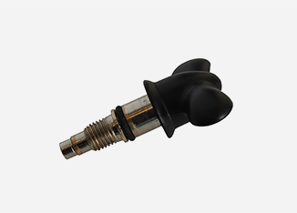  
                        

                            

                                

                            

                            

                                <h6>Название изделия</h6>
                                
Краткое описание изделия,  
                                    характеристика,  
                                    что-нибудь еще

                            

                        

                    

                    

                        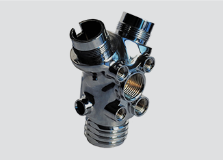
                        

                            

                                

                            

                            

                                <h6>Название изделия</h6>
                                
Краткое описание изделия,  
                                    характеристика,  
                                    что-нибудь еще

                            

                        

                    

                

                

                    

                        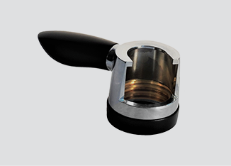  
                        

                            

                                

                            

                            

                                <h6>Название изделия</h6>
                                
Краткое описание изделия,  
                                    характеристика,  
                                    что-нибудь еще

                            

                        

                    

                    

                        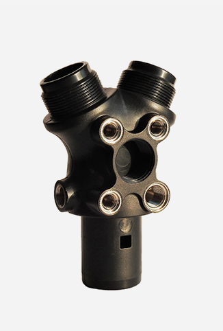
                        

                            

                                

                            

                            

                                <h6>Название изделия</h6>
                                
Краткое описание изделия,  
                                    характеристика,  
                                    что-нибудь еще

                            

                        

                    

                

            

            

                

                    
Показать еще

                    <button></button>
                

            

        </section>

        <section id="Stages-section">
            <h2>Этапы производства  
                пресс-формы</h2>
            <h4>Готовая пресс-форма за  36 дней в  3 шага  </h4>
            

                

                    

                        

                        
                        <h6>01. Проектирование  
                            и техническая документация</h6>
                        
Полное конструкторское и технологическое
                            сопровождение. От проектирования формы и готовых
                            изделий, до ввода в промышленную эксплуатацию
                            на вашем предприятии.3D модель и чертёж пресс-
                            формы создаётся нашими опытными конструкторами.
                            Если у вас есть собственные чертежи и модели мы не
                            перекладываем ответственность на вас,
                            а сопровождаем их для получения идеального
                            результата.

                    

                    

                        

                        
                        <h6>03. Логистика и ВЭД</h6>
                        
Ускоренная доставка и таможня.
                            Отсутствие бюрократических проволочек.
                            Доставка до вашего склада в течение 5 дней.

                    

                

                

                    

                    

                    

                    
                

                

                    

                        

                        
                        <h6>02.Производство пресс-формы в Китае</h6>
                        
Постоянный контроль изготовления на заводе,
                            с периодическими фото – отчётами, чтобы вы знали,
                            что ваше изделие в работе. Оперативная доставка
                            тестовых образцов курьером, для быстрого
                            согласования (1-2 рабочих дня). Финальная доработка
                            формы и окончательное закаливание.

                    

                

            

        </section>

        <section id="Answers-section">
            <h2>Ответы на самые популярные  
                вопросы</h2>
            <h4>Об этом спрашивают  7  клиентов  из 10 </h4>
            

            

                

                    

                        

                            <h6>01. Как долго придется ждать готовую  
                                пресс-форму? </h6>
                            <button></button>
                        

                    

                    

                    

                        

                            <h6>03. У вас можно заказать пресс-форму  
                                по своим чертежам? </h6>
                            <button></button>
                        

                    

                    

                

                

                    

                        

                            <h6>02. Качество пресс-форм, изготавливаемых  
                                в России и Китае, как-то отличается? </h6>
                            <button></button>
                        

                    

                    

                    

                        

                            <h6>04. Почему у вас на сайте нет цен? </h6>
                            <button></button>
                        

                    

                    

                

            

        </section>

        <section id="Calculation-section">
            <h2>Рассчёт пресс-форм</h2>
            <h4>Мы подготовим индивидуальный и выгодный  
                рассчёт пресс-форм. Для этого заполните заявку  
                максимально подробно</h4>
            

                

                    
Для вашего удобства мы подготовили  
                        типовые формы документов которые вы  
                        можете скачать, это сильно ускорит  
                        процесс осмечивания и коммуникации.

                

                

                    

                        
Технологическая  
                            карта на разработку  
                            пресс-формы

                        
                    

                    

                        
Типовой договор  
                            на разработку  
                            пресс-формы

                        
                    

                

            

            

                

                    

                        <input type="text" placeholder="Ваше имя">
                        <input type="text" placeholder="Контактный телефон">
                    

                    

                        <input type="text" placeholder="Название компании">
                        <input id="input-dashed" type="text" placeholder="Загрузите дополнительные файлы">
                    

                

                

                    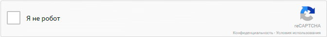
                

                

                    

                        
Отправить заявку

                        <button></button>
                    

                

                

                    
Отправляя заявку, вы принимаете условия  соглашения обработки персональных данных 
                    

                

            

        </section>

        <section id="Boel-teams">
            <h2>Мы собрали лучших  
                в одну команду</h2>
            

            

                

                    

                        <h6>Константин
                            Александрович</h6>
                        
Литейщик
                            с 10 летним стажем

                    

                    
                

                

                    

                        <h6>Дмитрий
                            Константинович</h6>
                        
Технический
                            директор компании

                    

                    
                

                

                    

                        <h6>Иван
                            Петрович</h6>
                        
Технолог
                            с 5 летним стажем 

                    

                    
                

                

                    

                        <h6>Мистер Вонг</h6>
                        
Технический
                            эксперт. Выполняет
                            контроль и приёмку
                            пресс-форм в Китае

                    

                    
                

            

        </section>

        <section id="Contacts-section">
            <h2>Наши контакты</h2>
            

            

                

                    

                        
                    

                    
Россия,  
                        630028 Новосибирск,  
                        ул. 2-я Высокогорная 1/1, 301

                

                

                    

                        
                    

                    
+7 (383) 287-11-57

                

                

                    

                        
                    

                    
  info@boel.pro

                

                

                    

                        
                    

                    
boelingeneering

                

            

            
Скачать реквизиты

        </section>
    </main>
    

        
    

</body>

</html>
